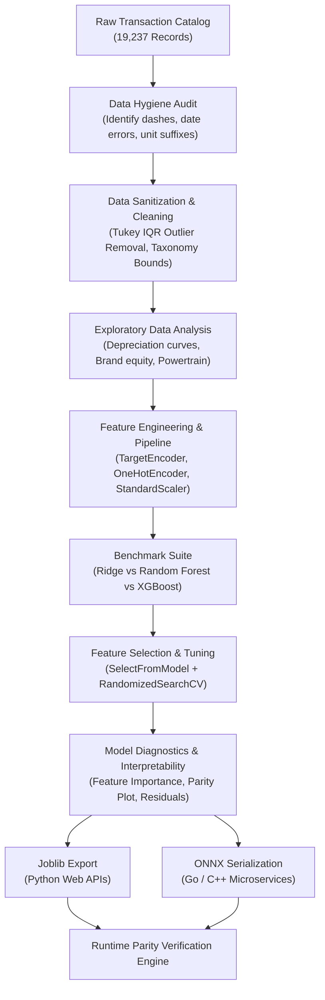

# 🚗 Automotive Valuation Intelligence: End-to-End Car Price Prediction & MLOps Pipeline

[](https://python.org)
[](https://scikit-learn.org)
[](https://xgboost.ai)
[](https://onnxruntime.ai)
[](LICENSE)

An enterprise-grade, end-to-end Machine Learning and MLOps solution designed to predict fair market valuation for used vehicles. Built on a dataset of **19,200+ vehicle transactions**, this project covers rigorous data auditing, domain-driven feature sanitization, leakage-free preprocessing with Target Encoding, multi-algorithm benchmarking, Bayesian-style randomized hyperparameter tuning, and dual-format serialization (**Joblib** & **ONNX**) for low-latency Go/C++ microservice integration.

---

## 📌 Executive Summary & Key Highlights

* **High-Accuracy Valuation**: Achieved a test-set **$R^2$ of 0.8269** (82.7% market variance explained), a **Mean Absolute Error (MAE) of $3,368.16**, and a **Root Mean Squared Error (RMSE) of $5,641.07**, establishing a competitive commercial valuation baseline across 15,661 cleaned vehicle transactions.
* **Leakage-Free Preprocessing**: Leveraged Scikit-Learn's native `TargetEncoder(smooth="auto")` inside a strict `ColumnTransformer` pipeline, effectively encoding high-cardinality vehicle makes and models without test set target contamination.
* **Dual-Format Model Deployment**:
  * **Joblib (`saved_models/car_price_xgboost_model.joblib`)**: Ready for standard Python web services (FastAPI/Flask).
  * **ONNX (`saved_models/car_price_model.onnx`)**: Standardized Open Neural Network Exchange graph capable of sub-millisecond scoring (~0.72 ms latency) in Go, Rust, or C++ microservices without Python runtime dependencies.
* **Automated Runtime Parity**: Includes an automated verification engine validating prediction consistency between Scikit-Learn and ONNX Runtime.

---

## 📊 End-to-End Workflow Architecture



---

## 📈 Benchmark Performance Comparison

| Model Architecture | MAE ($ USD) | RMSE ($ USD) | $R^2$ Score | Deployment Feasibility |
| :--- | :---: | :---: | :---: | :--- |
| **Ridge Regression (L2 Baseline)** | $7,124.09 | $9,974.79 | 0.4587 | Low accuracy, linear underfitting |
| **Random Forest (Equalized: depth=10)** | $4,290.27 | $6,356.37 | 0.7802 | Higher error under identical capacity constraints |
| **XGBoost Regressor (Equalized: depth=10)** | $3,605.86 | $5,984.60 | 0.8052 | Superior baseline gradient boosting |
| **Tuned XGBoost + Feature Selection (Champion)** | **$3,368.16** | **$5,641.07** | **0.8269** | **Optimal accuracy, minimal latency (~0.72 ms ONNX)** |

---

## 🔍 Key Exploratory & Market Insights

1. **Non-Linear Depreciation Curve**: Peak secondary market valuations for late-model inventory (ages 6–8 years) median at ~$25,700, followed by steady depreciation toward ~$16,600 at age 10, ~$11,900 at age 15, and finally settling into a resilient utility floor of ~$5,000 – $10,000 for vehicles older than 20 years.
2. **Brand Equity Hierarchy**: SsangYong ($30,596 median, late-model SUV heavy) and Hyundai ($19,121 median) lead high-volume transaction values, while German executive marques like BMW ($13,485 median, $17,835 mean) and Mercedes-Benz ($12,388 median, $17,021 mean) show wide IQR spreads ($24,500 – $26,600+ at Q75). Budget makes like Opel ($6,586 median) and Nissan ($8,467 median) trade at the lowest median price tiers.
3. **Powertrain & Gearbox Impact**: Tiptronic gearboxes command a median valuation of $18,503 (a 2.1× multiplier over Manual at $8,781), while Automatic transmissions median at $14,113 (a 1.6× premium).
4. **Safety as a Tier Proxy**: Vehicles equipped with comprehensive modern restraint systems (12–16 airbags) command a median price of $21,326, representing a +41.7% valuation premium over base configurations with 0–4 airbags ($15,053).
5. **High-Cardinality Categorical Drivers (`Model` & `Manufacturer`)**: Vehicle model name is the single most dominant valuation determinant ($r = 0.62$, accounting for 38.7% of target price variance), surpassing overall manufacturer brand equity ($r = 0.37$, 13.5%). Out-of-fold cross-validated Target Encoding is implemented to retain this granular signal (1,365 models across 58 manufacturers) without sparse dimensionality explosion.

---

## 🚀 Quickstart & Reproduction Guide

### 1. Prerequisites
- Python 3.10+ (Tested on Python 3.14)
- Git

### 2. Environment Setup
```powershell
# Clone or navigate to the repository
cd d:\Projects\Data_Science\car_price_prediction

# Create the virtual environment
python -m venv .venv

# Activate the virtual environment (Windows PowerShell)
.\.venv\Scripts\Activate.ps1

# Install pinned dependencies
pip install -r requirements.txt
```

### 3. Download Dataset
Download the Kaggle dataset into the `data/` directory:
```powershell
python download_dataset.py
```
*(Options: `--output-dir <path>`, `--force`)*

### 4. Register Jupyter Kernel
```powershell
python -m ipykernel install --user --name=car_price_venv --display-name="Python (.venv - Car Price)"
```

### 5. Run or Open Notebook
You can open and interact with [`car_price_prediction.ipynb`](file:///d:/Projects/Data_Science/car_price_prediction/car_price_prediction.ipynb) directly in VS Code, JupyterLab, or GitHub with all outputs, charts, and benchmarks rendered.

---

## 💡 Production Microservice Usage

### Python (Joblib) Inference
```python
import joblib
import pandas as pd

# Load serialized pipeline from saved_models directory
model = joblib.load("saved_models/car_price_xgboost_model.joblib")

sample_car = {
    "Levy": 800,
    "Manufacturer": "HONDA",
    "Model": "Civic",
    "Prod. year": 2018,
    "Category": "Sedan",
    "Leather interior": "Yes",
    "Fuel type": "Petrol",
    "Engine volume": 1.8,
    "Engine turbo": 0,
    "Mileage": 65000,
    "Cylinders": 4.0,
    "Gear box type": "Automatic",
    "Drive wheels": "Front",
    "Doors": "04-May",
    "Wheel": "Left wheel",
    "Color": "Black",
    "Airbags": 6,
}

estimated_price = model.predict(df_processed)[0]
print(f"Fair Market Valuation: ${estimated_price:,.2f}")
```

### Golang / Cross-Platform (ONNX Runtime)
The exported [`car_price_model.onnx`](file:///d:/Projects/Data_Science/car_price_prediction/saved_models/car_price_model.onnx) (located in `saved_models/car_price_model.onnx`) can be loaded directly using the official `onnxruntime` C-API, Go bindings (`github.com/owulveryck/onnx-go` or `github.com/yalue/onnxruntime_go`), or Rust (`ort`) for high-throughput, low-latency microservice architectures.

---

## 👤 Author & Acknowledgments
* **Author**: Data Scientist & Machine Learning Engineer
* **Dataset**: Automobile Consulting Used Vehicle Challenge (Georgian & International Market Listings)
