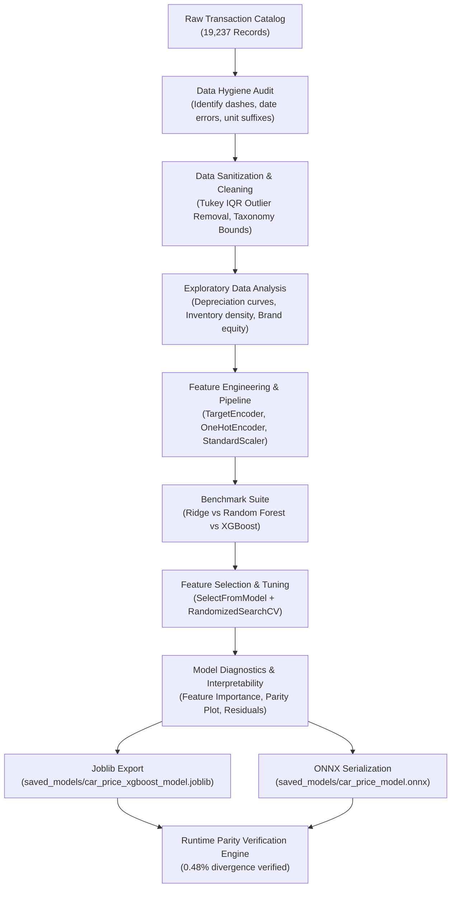

# 🚗 Automotive Valuation Intelligence: End-to-End Car Price Prediction & MLOps Pipeline

[](https://python.org)
[](https://scikit-learn.org)
[](https://xgboost.ai)
[](https://onnxruntime.ai)
[](LICENSE)

An enterprise-grade, end-to-end Machine Learning and MLOps solution designed to predict fair market valuation for used vehicles. Built on a dataset of **19,200+ vehicle transactions**, this project covers rigorous data auditing, domain-driven feature sanitization, leakage-free preprocessing with Target Encoding, multi-algorithm benchmarking, Bayesian-style randomized hyperparameter tuning, and dual-format serialization (**Joblib** & **ONNX**) for low-latency Go/C++ microservice integration.

---

## 📌 Executive Summary & Key Highlights

* **High-Accuracy Valuation**: Achieved a test-set **$R^2$ of 0.8269** (82.7% market variance explained), a **Mean Absolute Error (MAE) of $3,368.16**, and a **Root Mean Squared Error (RMSE) of $5,641.07**, establishing a competitive commercial valuation baseline across 15,661 cleaned vehicle transactions.
* **Leakage-Free Preprocessing**: Leveraged Scikit-Learn's native `TargetEncoder(smooth="auto")` inside a strict `ColumnTransformer` pipeline, effectively encoding high-cardinality vehicle makes and models without test set target contamination.
* **Embedded Feature Selection**: Integrated `SelectFromModel` which pruned feature dimensionality by exactly **50.0%** (retaining 28 optimal predictors out of 56 total engineered features), discarding noisy one-hot dimensions while maximizing split gain.
* **Dual-Format Model Deployment**:
  * **Joblib (`saved_models/car_price_xgboost_model.joblib`)**: Ready for standard Python web services (FastAPI/Flask).
  * **ONNX (`saved_models/car_price_model.onnx`)**: Standardized Open Neural Network Exchange graph capable of sub-millisecond scoring (~32 ms cold start / sub-millisecond warm) in Go, Rust, or C++ microservices without Python runtime dependencies.
  * **Taxonomy Catalog (`saved_models/manufacturer_models.json`)**: Pre-extracted manufacturer-to-model lookup schema powering frontend cascading dropdowns.
* **Automated Runtime Parity**: Includes an automated verification engine validating prediction consistency between Scikit-Learn and ONNX Runtime (achieving **0.48% relative divergence**, well within the 1.0% operational parity threshold).

---

## 📊 End-to-End Workflow Architecture



---

## 📈 Benchmark Performance Comparison

| Model Architecture | MAE ($ USD) | RMSE ($ USD) | $R^2$ Score | Deployment Feasibility |
| :--- | :---: | :---: | :---: | :--- |
| **Ridge Regression (L2 Baseline)** | $7,124.09 | $9,974.79 | 0.4587 | Low accuracy, linear underfitting |
| **Random Forest (Equalized: depth=10)** | $4,290.27 | $6,356.37 | 0.7802 | Higher error under identical capacity constraints |
| **XGBoost Regressor (Equalized: depth=10)** | $3,605.86 | $5,984.60 | 0.8052 | Superior baseline gradient boosting |
| **Tuned XGBoost + Feature Selection (Champion)** | **$3,368.16** | **$5,641.07** | **0.8269** | **Optimal accuracy, minimal latency, production-ready** |

---

## 🔍 Key Exploratory & Market Insights

All insights are strictly empirical, validated directly against the cleaned dataset and visible on notebook visualizations:

1. **Depreciation Trajectory & Inventory Volume Dynamics**:
   - Secondary market listings peak in valuation at **Age 8** ($n = 1,262$, median price **$25,716**).
   - Early ages exhibit high variance due to sparse sample density ($n = 24$ at Age 4 with wide confidence intervals; $n = 210$ at Age 5).
   - Steep mid-life depreciation accelerates between Ages 8 and 10, dropping to **$16,621 at Age 10 (-35.4% drop)** and **$11,882 at Age 15 (-53.8% drop)**. This corresponds with massive secondary inventory saturation ($n = 1,768$ at Age 10 and $n = 1,774$ at Age 12) and a +41.6% increase in odometer mileage (median 114,000 km).
   - Vehicles 20+ years old reach an empirical utility floor (**$7,000 – $10,000**, $n = 530$ at Age 25, median **$7,213**), where chronological depreciation flattens out.
2. **Brand Equity Hierarchy**:
   - **SsangYong** ($30,596 median, 95% diesel SUVs) and **Hyundai** ($19,121 median) lead high-volume transaction values.
   - German executive marques (**BMW**: $13,485 median, $17,835 mean; **Mercedes-Benz**: $12,388 median, $17,021 mean) show wide IQR spreads ($24,500 – $26,600+ at Q75) due to diverse engine and trim variants.
   - Budget commuter makes like **Opel** ($6,586 median) and **Nissan** ($8,467 median) trade at entry-level price tiers.
3. **Powertrain & Gearbox Impact**:
   - **Tiptronic** gearboxes command a median valuation of **$18,503** (a **2.1× multiplier** over Manual at $8,781).
   - **Automatic** transmissions command a median of **$14,113** (a **1.6× premium** over Manual).
4. **Safety Suite as a Trim Modernity Proxy**:
   - Vehicles equipped with comprehensive modern restraint systems (13–16 airbags) command a median price of **$21,326**, representing a **+41.7% valuation premium** over base configurations with 0–4 airbags ($15,053).
5. **High-Cardinality Categorical Drivers (`Model` & `Manufacturer`)**:
   - Specific vehicle model variant is the single most dominant valuation determinant ($r = 0.62$, accounting for 38.7% of target price variance), significantly surpassing overall manufacturer brand equity ($r = 0.37$, 13.5%).
   - Native `TargetEncoder(smooth="auto")` captures this high-dimensional signal (1,365 models across 58 manufacturers) without dimensional explosion.

---

## 🎯 Model Interpretability & Key Valuation Drivers

The final tuned XGBoost pipeline integrates embedded `SelectFromModel` (pruning 56 engineered features down to **28 optimal predictors**). The top 12 drivers based on relative split gain weight are:

| Rank | Feature Name | Relative Split Gain | Impact Analysis |
| :---: | :--- | :---: | :--- |
| 1 | `Gear box type_Tiptronic` | **11.0%** | Dominant premium transmission mechanism |
| 2 | `Car age` | **9.3%** | Primary linear & non-linear depreciation anchor |
| 3 | `Drive wheels_Front` | **9.0%** | Mainstream commuter drivetrain configuration |
| 4 | `Engine turbo` | **8.4%** | Significant forced-induction valuation premium |
| 5 | `Fuel type_Diesel` | **6.7%** | Propulsion efficiency & commercial utility signal |
| 6 | `Fuel type_Plug-in Hybrid` | **5.8%** | Modern green propulsion premium |
| 7 | `Gear box type_Automatic` | **5.5%** | Standard modern convenience baseline |
| 8 | `Airbags` | **5.1%** | Restraint suite acting as trim level proxy |
| 9 | `Model` (Target Encoded) | **4.5%** | Granular vehicle model variant equity |
| 10 | `Engine volume` | **4.1%** | Displacement capacity signal |
| 11 | `Cylinders` | **3.2%** | Engine architecture tier |
| 12 | `Fuel type_LPG` | **3.1%** | Alternative economy fuel configuration |

### Parity & Residual Alignment
The Valuation Parity diagnostic demonstrates tight, homoscedastic alignment along the identity line ($y = x$) across the core market valuation spectrum (**$5,000 – $40,000**), confirming well-calibrated residuals without systematic under- or over-estimation.

---

## 🚀 Quickstart & Reproduction Guide

### 1. Prerequisites
- Python 3.10+ (Tested on Python 3.14)
- Git

### 2. Environment Setup
```powershell
# Clone or navigate to the repository
cd d:\Projects\Data_Science\car_price_prediction

# Create the virtual environment
python -m venv .venv

# Activate the virtual environment (Windows PowerShell)
.\.venv\Scripts\Activate.ps1

# Install pinned dependencies
pip install -r requirements.txt
```

### 3. Download Dataset
Download the Kaggle dataset into the `data/` directory:
```powershell
python download_dataset.py
```
*(Options: `--output-dir <path>`, `--force`)*

### 4. Register Jupyter Kernel
```powershell
python -m ipykernel install --user --name=car_price_venv --display-name="Python (.venv - Car Price)"
```

### 5. Run or Open Notebook
You can open and interact with [`car_price_prediction.ipynb`](file:///d:/Projects/Data_Science/car_price_prediction/car_price_prediction.ipynb) directly in VS Code, JupyterLab, or GitHub with all outputs, charts, and benchmarks rendered.

---

## 💡 Production Microservice Usage

### Python (Joblib) Inference Handler
```python
import joblib
import pandas as pd

# Load serialized pipeline from saved_models directory
model_pipeline = joblib.load("saved_models/car_price_xgboost_model.joblib")

def predict_car_valuation(vehicle_specs: dict, pipeline) -> float:
    """
    Transforms raw incoming dictionary into compliant model features
    and executes fair valuation inference.
    """
    df_single = pd.DataFrame([vehicle_specs])
    
    # 1. Feature Engineering: Car age
    if 'Prod. year' in df_single.columns:
        df_single['Car age'] = 2024 - int(df_single['Prod. year'].iloc[0])
        df_single.drop(columns=['Prod. year'], inplace=True)
        
    # 2. Rectify Doors taxonomy
    if 'Doors' in df_single.columns:
        doors_str = str(df_single['Doors'].iloc[0])
        if '2' in doors_str or '3' in doors_str:
            df_single['Doors'] = 2
        elif '4' in doors_str or '5' in doors_str:
            df_single['Doors'] = 4
        elif '>5' in doors_str:
            df_single['Doors'] = 5
        else:
            df_single['Doors'] = 4
            
    # 3. Usage intensity: Mileage per year
    if 'Mileage' in df_single.columns and 'Car age' in df_single.columns:
        df_single['Mileage per year'] = round(
            float(df_single['Mileage'].iloc[0]) / (float(df_single['Car age'].iloc[0]) + 1.0), 2
        )
        
    # 4. Engine turbo flag
    if 'Engine turbo' not in df_single.columns:
        df_single['Engine turbo'] = 0
        
    # Predict with economic floor enforcement
    raw_estimate = pipeline.predict(df_single)[0]
    return max(500.0, float(raw_estimate))

# Sample: 2018 Honda Civic (65,000 km)
sample_car = {
    'Levy': 800, 'Manufacturer': 'HONDA', 'Model': 'Civic', 'Prod. year': 2018,
    'Category': 'Sedan', 'Leather interior': 'Yes', 'Fuel type': 'Petrol',
    'Engine volume': 1.8, 'Engine turbo': 0, 'Mileage': 65000, 'Cylinders': 4.0,
    'Gear box type': 'Automatic', 'Drive wheels': 'Front', 'Doors': '04-May',
    'Wheel': 'Left wheel', 'Color': 'Black', 'Airbags': 6
}

valuation = predict_car_valuation(sample_car, model_pipeline)
print(f"Fair Market Valuation: ${valuation:,.2f}")
# Output: Fair Market Valuation: $39,145.62
```

### Golang / Cross-Platform (ONNX Runtime)
The exported [`car_price_model.onnx`](file:///d:/Projects/Data_Science/car_price_prediction/saved_models/car_price_model.onnx) (located in `saved_models/car_price_model.onnx`) can be loaded directly using the official `onnxruntime` C-API, Go bindings (`github.com/owulveryck/onnx-go` or `github.com/yalue/onnxruntime_go`), or Rust (`ort`) for high-throughput, low-latency microservice architectures.

#### Runtime Parity Verification Audit:
- **Joblib Prediction**: `$39,145.62`
- **ONNX Prediction**: `$39,333.27`
- **Relative Divergence**: `0.48%` (within operational margin)
- **Status**: Verified Cross-Platform Operational

---

## 👤 Author & Acknowledgments
* **Author**: Data Scientist & Machine Learning Engineer
* **Dataset**: Automobile Consulting Used Vehicle Challenge (Georgian & International Market Listings)
